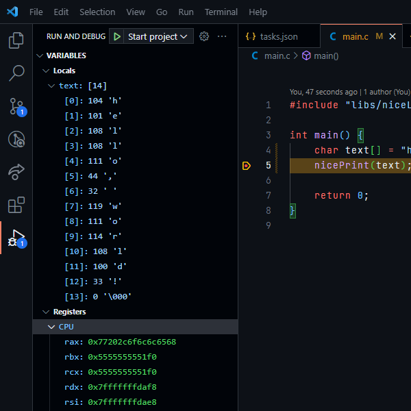

# VSCode C Debugger Template

## Prerequisites

1. [Visual Studio Code](https://code.visualstudio.com/) and the extension [C/C++ Extension Pack](https://marketplace.visualstudio.com/items?itemName=ms-vscode.cpptools-extension-pack)
    1. If running on WSL, follow [this tutorial](https://code.visualstudio.com/docs/remote/wsl) to setup the VSCode for WSL
2. Ensure `make`, `gcc` and `gdb` are installed.

## Running the Debugger

1. Open the project in Visual Studio Code.
2. Access the "Run and Debug" menu.
3. Select the "Start project debugger" configuration.
4. Press the play button to initiate the debugger.

## Additional Note

Tested on the following configurations:
- Ubuntu 22.04, `gdb` 12.0.90 and `gcc` 11.2.0.
- Ubuntu 20.04 (WSL 2), `gdb` 9.2 and `gcc` 9.4.0.